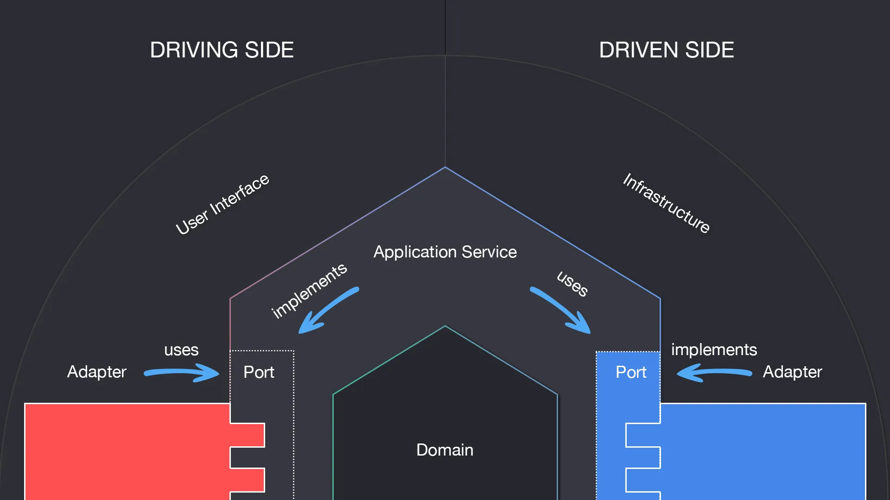

# 📖 Introduction

Definition (wikipedia)

> The hexagonal architecture, or ports and adapters architecture, is an architectural pattern used in software design. It aims at creating loosely coupled application components that can be easily connected to their software environment by means of ports and adapters. This makes components exchangeable at any level and facilitates test automation.

Intend [by the author Alistair Cockburn](https://alistair.cockburn.us/hexagonal-architecture/)

> Allow an application to equally be driven by users, programs, automated test or batch scripts, and to be developed and tested in isolation from its eventual run-time devices and databases.
> When any driver wants to use the application at a port, it sends a request that is converted by an adapter for the specific technology of the driver into an usable procedure call or message, which passes that to the application port. The application is blissfully ignorant of the driver’s technology. When the application has something to send out, it sends it out through a port to an adapter, which creates the appropriate signals needed by the receiving technology (human or automated). The application has a semantically sound interaction with the adapters on all sides of it, without actually knowing the nature of the things on the other side of the adapters.

Idea/concept in a picture:



## 🚀 Start the show case application

The application exposes a scalar ui, which is locally accesible on [http://localhost:8080/scalar/v1](http://localhost:8080/scalar/v1). Discover the available endpoints on the UI or use the [OpenApi Spec](http://localhost:8080/openapi/v1.json). The OpenApi Spec can be imported by other tools like e.g. Postman.

### Local Development (for developers)

Prerequisites:

- Docker installed
- dotnet SDK installed (v8)

To test and debug locally, you need to run the following commands:

```terminal
docker compose -f compose.infra.yaml --profile monitoring up -d
```

> The monitoring profile is optional and can be dropped. If used, a telemetry backend as defined in the [opentelemetry section](#-observability--opentelemetry) is spinned up.

This starts (as per today) a plain postgres instance without any seed.

Now, start the actual asp dotnet core application with the `Development` profile:

```terminal
dotnet run --project API/API.Adapters Environment=Development
```

### Local Development in a complete dockerized environment (for e.g tester)

Prerequisites:

- Docker installed

Start the application by running:

```terminal
docker compose up --build -d
```

Or with monitoring profile:

```terminal
docker compose --profile monitoring up --build -d
```

### Cleanup

If you want to stop all containers, run:

```terminal
docker compose down
```

If you want to get a clean database at the next startup, simply run the down command with the '-v' flag:

```terminal
docker compose down -v
```

## 🏃‍♂️ Getting Started

Begin with defining a name for your service/application by updating the [AppName](./API/API.Adapters/AssemblyInfo.cs) constant. Additionally, update all namespaces projectwide (there are arch unit tests which enforce this guideline): Search and replace `ExampleBackend` with your new defined app name throughout the whole project.

How you start implementing your application is up to you. Many start by defining the application's business logic in the [Domain Logic](./Domain/Domain.Logic/) folder. But it may also be a good start to define your entry points / REST API first. Follow the hexagonal architecture principles by placing your code in the correct, provided layers. You can use the show case application as a guideline to see how things are connected.

If your application requires a specific Infrastructure setup (e.g. Postgres), make sure to have it configured properly and that an corresponding instance is running.

## 🛠️ Build and Test

In order to ensure that the intended architecture is maintained, there are some basic ArchUnit.Tests ([docs](https://archunitnet.readthedocs.io/en/stable/)) which will ensure that the dependencies do not cross the boundaries established by hexagonal architecture. Enhance the ArchUnit tests with other guidelines you want to maintain, like Namespaces, Naming Conventions and so on.

Also, a couple of sample tests in the different modules are provided to show how things can be tested. In order to run the repository tests, a running docker instance is required. (E.g. [Docker Desktop](https://www.docker.com/products/docker-desktop/))

```terminal
dotnet test
```

## 🧱 Project Structure

<!-- prettier-ignore -->
```md
.
├── API
│   ├── API.Adapters
│   ├── API.Adapters.Test
│   └── API.Ports
├── ArchUnit.Tests
├── Domain
│   ├── Domain.Data
│   ├── Domain.Logic
│   └── Domain.Logic.Test
└── Infrastructure
    ├── Infrastructure.Adapters
    ├── Infrastructure.Adapters.Test
    └── Infrastructure.Ports
```

- ArchUnit.Tests
  - Important tests to gurantee the below structure keeps maintained
- Domain
  - Domain Logic _implements_ API.Ports and _uses_ Infrastructure.Ports
  - Tests that validate the domain logic
  - Domain Data contains Classes/DTOs which can be shared across layers
- Infrastructure (Outgoing: infrastructure the application talks with)
  - Infrastructure.Ports and their implementations (i.e. Adapters)
  - Tests that validate the Infrastructure.Adapters
- API (Incoming: adapters to make it possible to talk with the application)
  - Responsible for injecting the necessary dependencies
  - API.Ports and their implementations (i.e. Adapters)
  - Tests that validate the API.Adapters

> Domain Logic and Infrastructure Adapter implementations are internal, and only exposed through DependencyInjection extensions.

## 👩‍💻 Logging

We want to use structured Logging in order to read, filter and query logs in an easy manner. See [Logging in C# and .NET](https://learn.microsoft.com/en-us/dotnet/core/extensions/logging?tabs=command-line).
That means, if you are not in the API Adapter Layer (or not where you start the application), you can simply inject a logger Instance via the constructor of a class (like `ILogger<ExampleClass> logger`). Feel free to write logging extension methods in order to streamline your logging even more.

In all places where you can`t use DependencyInjection, a logger instance can be created the following way:

```csharp
ILogger<Function> logger = LoggerFactory.Create(builder => builder.AddConsole().AddJsonConsole()).CreateLogger<Function>();
```

To ensure that our logging stays consistent, there are ArchUnit tests which check if other logging mechanisms are used and which will fail in that case.

## 🔎 Observability / OpenTelemetry

[General information about observability](https://opentelemetry.io/docs/what-is-opentelemetry/)

We strongly recommend to use the default opentelemetry setup in this application. It ensures a minimal level of observability and can be fine-tuned if needed. When running `docker-compose` with the monitoring profile, a default backend of a `opentelemetry-collector`, `mimir/prometheus` (Metrics), `loki` (Logs), `tempo` (Traces) and `grafana` (Dashboard) is started. You will find the same or a similar setup in our production environment. To explore the telemetry data your application is producing, check out [Grafana Explore](http://localhost:4000/explore).

### Traces

Checkout [OpenTelemetry .NET Traces](https://github.com/open-telemetry/opentelemetry-dotnet/blob/main/docs/trace/README.md) for best practices, fine-tuning and examples.

#### Configuration example

```csharp
services.AddOpenTelemetry()
        .WithTracing(options =>
            {
                options.AddAspNetCoreInstrumentation();
                options.AddHttpClientInstrumentation();
                options.AddEntityFrameworkCoreInstrumentation();
                options.AddNpgsql();
                options.AddOtlpExporter();
            })
```

## Custom Traces

In order to group traces, it can be helpful to create Spans within the application flow. Therefore, there is a `Tracer.cs` class in each project, which can be used for doing so. Simply call the following before the action you want to have within a span:

```csharp
using var activity = Tracer.Source.StartActivity("<activity-display-name>");
```

We provided examples for this when creating a new Sak. Check it out.

### Logs

Checkout [OpenTelemetry .NET Logs](https://github.com/open-telemetry/opentelemetry-dotnet/blob/main/docs/logs/README.md) for best practices, fine-tuning and examples.

#### Configuration example

```csharp
services.AddOpenTelemetry()
        .WithLogging(
            logging => logging.AddOtlpExporter(),
            options => options.IncludeFormattedMessage = true
        );
```

### Metrics

Checkout [OpenTelemetry .NET Metrics](https://github.com/open-telemetry/opentelemetry-dotnet/blob/main/docs/metrics/README.md) for best practices, fine-tuning and examples.

#### Configuration example

```csharp
services.AddOpenTelemetry()
        .WithMetrics(options =>
            {
                options.AddAspNetCoreInstrumentation();
                options.AddHttpClientInstrumentation();
                options.AddOtlpExporter();
            });
```

## 📝 Further reads

[Medium: Hexagonal Architecture, there are always two sides to every story](https://medium.com/ssense-tech/hexagonal-architecture-there-are-always-two-sides-to-every-story-bc0780ed7d9c)
